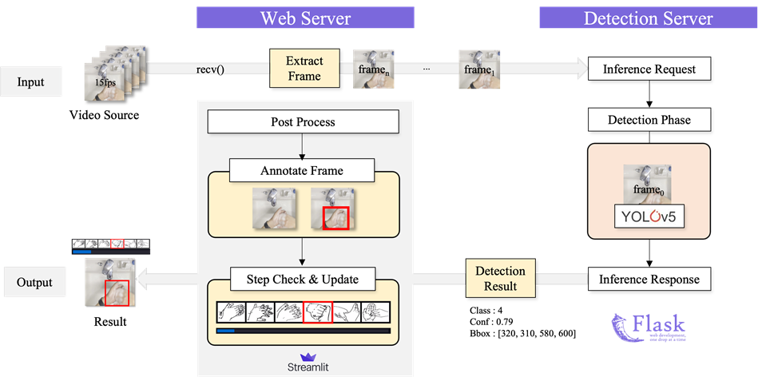

# 올바른 손 씻기 교육을 위한 손 씻기 단계 인식 모델

</br>

올바른 손 씻기 교육을 위한 손 씻기 단계 인식 모델

</br>

## 👨‍🌾 Team

- Level 2 CV Team 4 - 무럭무럭 감자밭 🥔
- 팀 구성원: 김세영, 박성진, 신승혁, 이상원, 이윤영, 이채윤, 조성욱

여기에다가 사진도 넣져?

## Project Overview

- 실시간 영상에서 손 씻기 단계를 판별하고 정부 권장 손 씻기 6단계 지침을 수행할 수 있게 도와주는 서비스
- 기존의 rule-based 방식으로는 변수를 고려하기 어려운 문제(피부색, 촬영 환경, 개인마다 다른 손 모양 등)가 있어 다양한 데이터를 통해 학습된 딥러닝 모델로 문제 해결
- 아동 손 씻기 교육을 위한 스마트폰 애플리케이션이나 음식점, 병원, 공공장소 등에서 사용될 수 있는 손 씻기 검수 애플리케이션 등 다양한 분야에서 사용될 수 있음

## Service Architecture



## Demo

비디오 링크를 달아야하나?

## Work Directory
```
├──dataset
|   ├──eda
|   ├──yolov5       # dataset by yolo format
|   └──json files   # dataset by coco format
├──output
|   ├──detectron
|   ├──mmdet
|   └──yolov5
├──detectron
├──mmdetection
├──Swin-Transformer-Object-Detection # swin-b
├──efficientdet
└──yolov5
```

## Model

모델 파일 안에 readme 따로 작성하면 거길로 링크 달?

## Serving

서빙도 마찬가지?

## Environment

os 천재만재님이 좀 적어주십셔