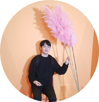
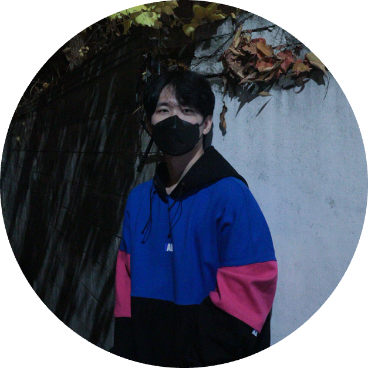

# 🧼 올바른 손 씻기 교육을 위한 손 씻기 단계 인식 모델

## 👨‍🌾 Team

### Level 2 CV Team 4 - 무럭무럭 감자밭 🥔🌱
|김세영|박성진|신승혁|이상원|이윤영|이채윤|조성욱|
|:-:|:-:|:-:|:-:|:-:|:-:|:-:|
|<a href="https://github.com/Seyoung9304"></a>|<a href="https://github.com/8639sung"></a>|<a href="https://github.com/seung-sss"></a>|<a href="https://github.com/14blacktea"></a>|<a href="https://github.com/YoonyoungL"></a>|<a href="https://github.com/rachel318318"></a>|<a href="https://github.com/ukcastle"></a>|

## 🔍 Project Overview

- 실시간 영상에서 손 씻기 단계를 판별하고 정부 권장 손 씻기 6단계 지침을 수행할 수 있게 도와주는 서비스
- 기존의 rule-based 방식으로는 변수를 고려하기 어려운 문제(피부색, 촬영 환경, 개인마다 다른 손 모양 등)가 있어 다양한 데이터를 통해 학습된 딥러닝 모델로 문제 해결
- 아동 손 씻기 교육을 위한 스마트폰 애플리케이션이나 음식점, 병원, 공공장소 등에서 사용될 수 있는 손 씻기 검수 애플리케이션 등 다양한 분야에서 사용될 수 있음


### 👀 Demo

<p align="center">
    
</p>


### 🧠 Model

#### Real Time Object Detection with YOLOv5

|Model||mAP50|
|---|:----|:---|
|YOLOv5s|Batch Size 144|0.715|
||+ Brightness Aug ↑ |0.7457|
||+ Mosaic, Mixup ↑ |0.7457|
|YOLOv5s Multiscale|Batch Size 64|0.715|
||+ Brightness Aug ↑ |0.8643|
||+ Mosaic, Mixup ↑ |0.8753|
|YOLOv5m|Batch Size 100|N/A|
||+ Brightness Aug ↑ |0.7966|
||+ Mosaic, Mixup ↑ |0.8375|


|Base YOLOv5s|Multiscale YOLOv5s w/ augment|
|:---:|:---:|
|||


### 🏗 Service Architecture

#### Overall Architecture

<p align="center">
    
</p>

#### Post Processing

<p align="center">
    
</p>


## 🗂 Work Directory
```
├──detect_server    # server for inference
|   ├──models           
|   ├──saved            # trained model (.pt)
|   ├──utils
|   └──detect_server.py
├──input            # generate dataset
|   ├──handtracking
|   ├──make_full_input.py
|   ├──make_input.py
|   └──make_kaggle_input.py
├──model_lab        # model experiments
|   ├──frame_classification
|   ├──object_detection
|   └──video_classification
├──src
└──web_server       # streamlit server
    ├──pic
    └──app.py
```

## ⚙️ Environment

- Runtime: Python 3.7
